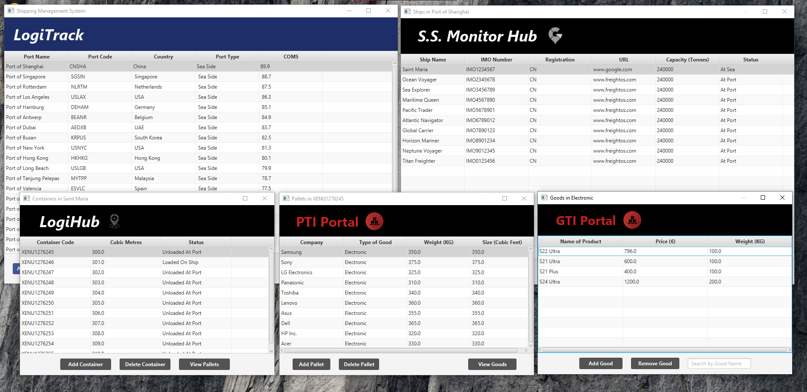

# Shipping Management System

The **Shipping Management System** #
is a Java-based application that manages ports, ships, containers, pallets, and goods.

This system allows users to add, view, and manage various shipping-related entities 
through a graphical user interface (GUI) built with JavaFX.




## Features

- **Port Management**: Add, view, and delete ports, each with specific attributes like port code, country, type, and communications information.
- **Ship Management**: Manage ships within each port, including details such as IMO number, registration, capacity, and status.
- **Container Management**: Manage containers within ships, including their cubic capacity, status, and associated pallets.
- **Pallet Management**: Manage pallets within containers, including details like company, type of goods, weight, and size.
- **Good Management**: Manage goods within pallets, with attributes like name, price, and weight.
- **Search and Filtering**: Search and filter through various entities within the system.
- **Persistence**: Save and load data from files to maintain the state of the system.

## Setup and Installation

### Prerequisites

- **Java 8** or higher
- **JavaFX** (if not bundled with your JDK)
- **Maven/Gradle** (optional, for managing dependencies)

### Installation Steps

1. **Clone the repository:**

    ```bash
    git clone https://github.com/yourusername/shipping-management-system.git
    cd shipping-management-system
    ```

2. **Import the project into your IDE:**

    - For IntelliJ IDEA or Eclipse, import the project as a Maven/Gradle project if you are using it.
    - Ensure that JavaFX is properly configured in your IDE.

3. **Build the project:**

    - If using Maven:

        ```bash
        mvn clean install
        ```

    - If using Gradle:

        ```bash
        gradle build
        ```

4. **Run the application:**

    - You can run the application directly from your IDE by executing the `Launcher.java` class.

## Usage

### Start the Application:

- Run the `Launcher` class, which will initialize the system and display the main GUI.

### Managing Ports:

- Use the **"Add Port"** button to create new ports.
- View and delete existing ports from the ports table.

### Managing Ships:

- Within a selected port, use the **"Add Ship"** button to add ships.
- View, update, and delete ships within the port.

### Managing Containers:

- Within a selected ship, use the **"Add Container"** button to add containers.
- Manage the containers' status and associated pallets.

### Managing Pallets:

- Within a selected container, use the **"Add Pallet"** button to add pallets.
- Manage the pallets' goods and other attributes.

### Managing Goods:

- Within a selected pallet, use the **"Add Good"** button to add goods.
- View and delete goods associated with pallets.


## License

This project is licensed under the MIT License - see the [LICENSE](LICENSE) file for details.

## Contributing

If you would like to contribute to this project, please fork the repository and submit a pull request. Contributions, issues, and feature requests are welcome.

## Contact

For any inquiries or questions, feel free to reach out:

- **Email:** 20102440@mail.wit.ie
- **LinkedIn:** [Jacob Dickson](https://www.linkedin.com/in/jacob-dickson1)

